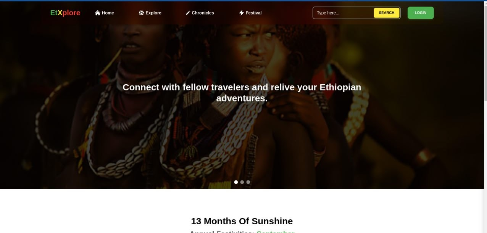

# EtXplore



EtXplore is a web application that allows users to explore Ethiopian culture, history, and traditions. The application provides users with a platform to learn about Ethiopia's diverse culture, history, and traditions through interactive content such as articles, and images. Users can also engage with the content by commenting, liking, and sharing it with others. EtXplore aims to promote Ethiopian culture and heritage by providing users with an engaging and informative platform to learn and explore.

## Features

- **Articles**: Users can read articles on various topics related to Ethiopian culture, history, and traditions. The articles are written by experts in the field and provide users with valuable insights into Ethiopia's rich cultural heritage.

- **Images**: Users can view images that capture the beauty and diversity of Ethiopian culture, history, and traditions. The images are sourced from photographers and artists who have captured the essence of Ethiopia in their work.

- **Comments**: Users can engage with the content by leaving comments on articles, and images. The comments section allows users to share their thoughts and opinions on the content and engage in meaningful discussions with other users.

- **Likes**: Users can like articles, and images to show their appreciation for the content. The like feature allows users to express their support for the content and help promote it to other users.

- **Sharing**: Users can share articles, and images with others through social media platforms. The sharing feature allows users to spread awareness about Ethiopian culture and heritage and encourage others to explore the content on EtXplore.

## Technologies Used

- **Frontend**: React, Redux, Tailwind CSS
- **Backend**: Laravel
- **Database**: MySQL

## Installation

1. Clone the repository:

```bash 
git clone https://github.com/Yosinan/etxplore
```

2.1 For the backend, navigate to the `api` directory:

```bash
cd api
```

2.2 Install the dependencies:

```bash
composer install
```

2.3 Create a `.env` file by copying the `.env.example` file:

```bash
cp .env.example .env
```

2.4 Generate an application key:

```
php artisan key:generate
```

2.5 Create a new database and update the `.env` file with your database credentials:

```
DB_CONNECTION=mysql
DB_HOST=127.0.0.1
DB_PORT=your_database_port
DB_DATABASE=your_database_name
DB_USERNAME=your_database_username
DB_PASSWORD=your_database_password
```

2.6 Run the migrations to create the database tables:

```
php artisan migrate
```

2.7 Start the Laravel server:

```
php artisan serve
```

3. 1 For the frontend, navigate to the `client` directory:

```bash
cd client
```

3.2 Install the dependencies:

```bash
npm install
```

3.3 Start the React server:

```bash
npm run dev
```

4. Open your browser and navigate to `http://localhost:5173` to view the application.

## Contributing

Contributions are welcome! Please feel free to submit a pull request or open an issue if you encounter any bugs or have any suggestions for improvements.